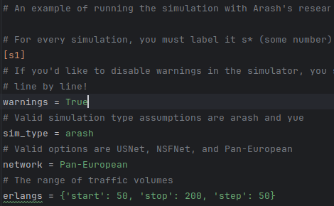
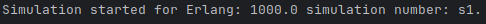

Getting Started
===============

The SDN simulator is python-based Software-defined Networking Simulator,
acting as a lightweight alternative
to existing SDN Simulators, while maintaining
the core capability found in others.

The SDN Simulator operates primarily off of
configuration (.ini) files, all of which can be customized
and catered to fit individual test needs.

Above is an example configuration file 'Arash_example.ini'.

Configuration Files contain and specify settings, all of which are required and integral to
the execution of the simulation.

Quick Start
=============
In order to beginning simulating a configuration file, first verify:

    - First, the configuration file must be saved as "Config.ini"

    - Second, the 'Config.ini' file must be saved within 'SDN_Simulator/Config/run_ini'

.. image:: ConfigDir.png
   :width: 600px
   :height: 250px
   :scale: 50 %
   :alt: alternate text
   :align: center

Note: 'Config.ini' in Run dir.

Once those two conditions are met, assuming that valid data (per the Configuration Assets page) has been
configured, the simulation will be able to execute.

In order to execute the simulation, the tester must run 'run_sim'.

Upon beginning the simulation, the console will produce messages
in line with the currently executing simulation, as seen above.

Note: If the tester attempts to execute 'run_sim' without a 'Config.ini' file saved to the 'run_ini' directory,
they will be reminded to do so. The simulation will be unable to run until that is ammended.