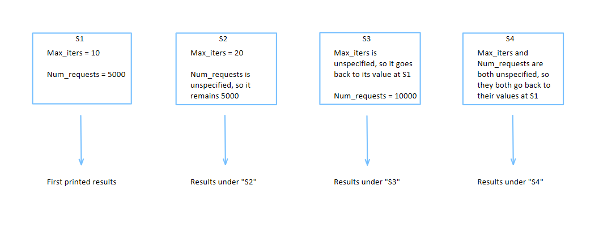

Getting Started for Professionals
===============

Running a Simulation
--------------------

Welcome to the Software Defined Elastic Optical Networking Simulator! In this tutorial, we'll guide you through the
process of running your first simulations and visualizing the results.

Go to the following path ``ini`` > ``example_ini``. There are two files that can be modified to your needs. Pick one of
the examples and copy it to ``run_ini``, then rename the file to ``config.ini``.

The ``config.ini`` has many sections, which include general, topology, SNR, AI, and file settings. There is also an
option to run several different simulations within one run of the program. Each section is labeled 's1', 's2', 's3' and so
forth. For instance, adding an 's2' section with 'k_paths=2' indicates a change in the number of paths from source to
destination in 'simulation 2'. Any parameters not specified will default to the values in 's1'. These processes run
concurrently, offering flexibility in experimentation, although running multiple processes simultaneously is optional.

.. raw:: html

If you're not using artificial intelligence, execute the script ``run_sim.py``. We recommend starting with a small
number of requests (e.g., 10) to ensure quick completion.

During simulation execution, important input data is saved in the ``input`` directory within the ``data`` directory,
organized by date and time down to the microsecond for easy reference. Once the simulation concludes, navigate to the
``output`` directory. Here, you'll find corresponding output data organized by simulation runs ('s1', 's2', etc.), each
containing results specific to the traffic volume simulated.

Plotting Simulations
--------------------

In progress

Running Simulations With AI
---------------------------

In progress