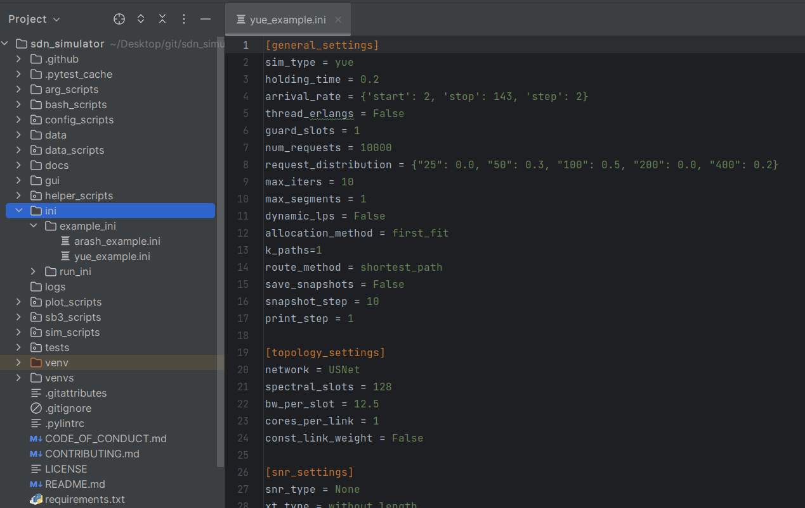
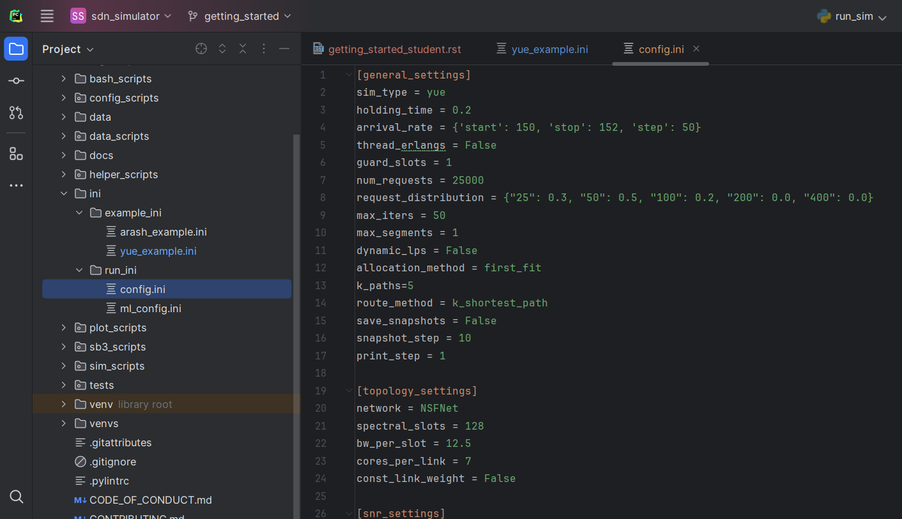

Getting Started for Students
===============

Running Your First Simulation
-----------------------------
Welcome to the Software Defined Elastic Optical Networking Simulator! In this tutorial, we'll guide you through the
process of running your first simulations and visualizing the results.

Note: make sure you have the most updated version by running ``git fetch``.

To begin, head over to the ``ini`` directory, followed by navigating to the ``example_ini`` directory.
The diagram below illustrates the location:

.. raw:: html

     

There are two examples of default parameters used by PhD students. The files are named after their creators. Select
either example, and copy it to the ``run_ini`` directory. Rename the copied file to ``config.ini``. This file contains
the assumptions used in simulation runs.

The file directory should look like:

.. raw:: html

     

With your configuration file set up, let's run your first simulation. If you're not using artificial
intelligence, execute the script ``run_sim.py``.

During simulation execution, important input data is saved in the ``input`` directory within the ``data`` directory,
organized by date and time down to the millisecond for easy reference. Once the simulation concludes, navigate to the
``output`` directory. Here, you'll find corresponding output data organized by simulation runs ('s1', 's2', etc.), each
containing results specific to the traffic volume simulated.

Once completed, this should look like:

.. image:: _images/first_sim_run.png
   :alt: Example simulation run
   :width: 700px
   :height: 500px
   :align: center

.. raw:: html

     

With your simulations completed, it's time to visualize and interpret the results. Let's move on to plotting and
analyzing the simulator's output.

Plotting Your First Simulation
------------------------------

In Progress

Analyzing the Results
---------------------

In progress