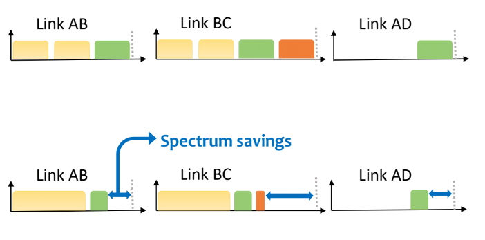
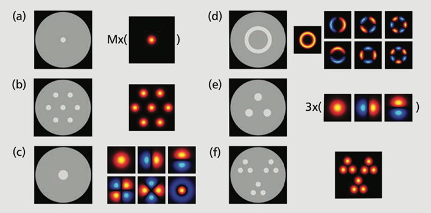

What is a SDON Simulator?
========================

In past years, data was transmitted over copper wires. They had several drawbacks, including that they could be tapped
into and were prone to interference from electromagnetic fields. However, in more recent years the introduction of
fiber-optic cables has resolved these issues. Fiber-optic cables have a few advantages, such as being able to send data
at near the speed of light, and being able to send more than one set of data at a time. As data travels through the
fiber-optic cables by pulses of light, the light can then be broken down into wavelengths that can be used to transmit
data while another wavelength transmits different data.

Wavelength Division Multiplexing (WDM)
--------------------------------------

In Wave Division Multiplexing (WDM), the wavelengths are broken into set groups. For example, they could be in spacings
of 50GHz each. If the data being sent only requires 25GHz, then the remaining 25Ghz is being reserved for use but not
being used.

Elastic Optical Networks (EONs)
-------------------------------

On the other hand, Elastic Optical Networks (EONs) can provide smaller channel spaces. The result from this is a more
efficient system that allows for more of the total bandwidth to be used. They also allow for a collection of adjacent
optical carriers on a particular wavelength, with the right proximity, to become a superchannel that allows for higher
capacity data transfers.

**Why is this important?**

Overall, the introduction of EONs allows for more efficient allocation of the resources we have, as there is a rapidly
approaching limit to the amount of wavelengths that can be used for WDM networks.

An example of such:

.. raw:: html

    

Credit: P. Afsharlar, "Resource Allocation Algorithms for Elastic Optical Networks," PhD. dissertation, Dept. Elect.
and Comp. Eng., Univ. of Mass. Lowell, Lowell, MA, United States, 2021.

The top line is what a traditional WDM approach would look like, and the bottom line is the same amount of information
instead sent via an EON approach.

Optical Networks - Single core and Multi-core
---------------------------------------------

A single core network has just one core overall. A mutli-core network has several different cores, allowing for
superchannels to form.

.. raw:: html

    

Credit: Y. Wang, "Dynamic Traffic Scheduling Frameworks with Spectral and Spatial Flexibility in SDM-EONs," PhD.
dissertation, Dept. Elect. and Comp. Eng., Univ. of Mass. Lowell, Lowell, MA, United States, 2022.

In the diagram, section a is an example of a single-core network, whereas section b is an example of a multi-core
network.

General Resource Allocation
---------------------------

There are two major constraints when it comes to both WDM and EONs. The first is the **Continuity constraint** in which
the transmission must remain on the same wavelength the entire distance it travels, as the cost of spectrum converters
is large. The second constraint is the **Contiguity constraint** in which an EONs superchannel requires a transponder
(also expensive), so as to keep down costs, the wavelengths used to create the superchannel must be next to one another.

The process to designate a wavelength is called Routing and Wavelength Assignment (RWA). There are four major versions
of this. The first is Random Wavelength Assignment, in which an open wavelength is randomly chosen. Second, there is
First-Fit, in which each wavelength is numbered and the first available one is chosen. Finally, there are the Least-Used
and Most-Used methods, which are the opposites of each other in method.